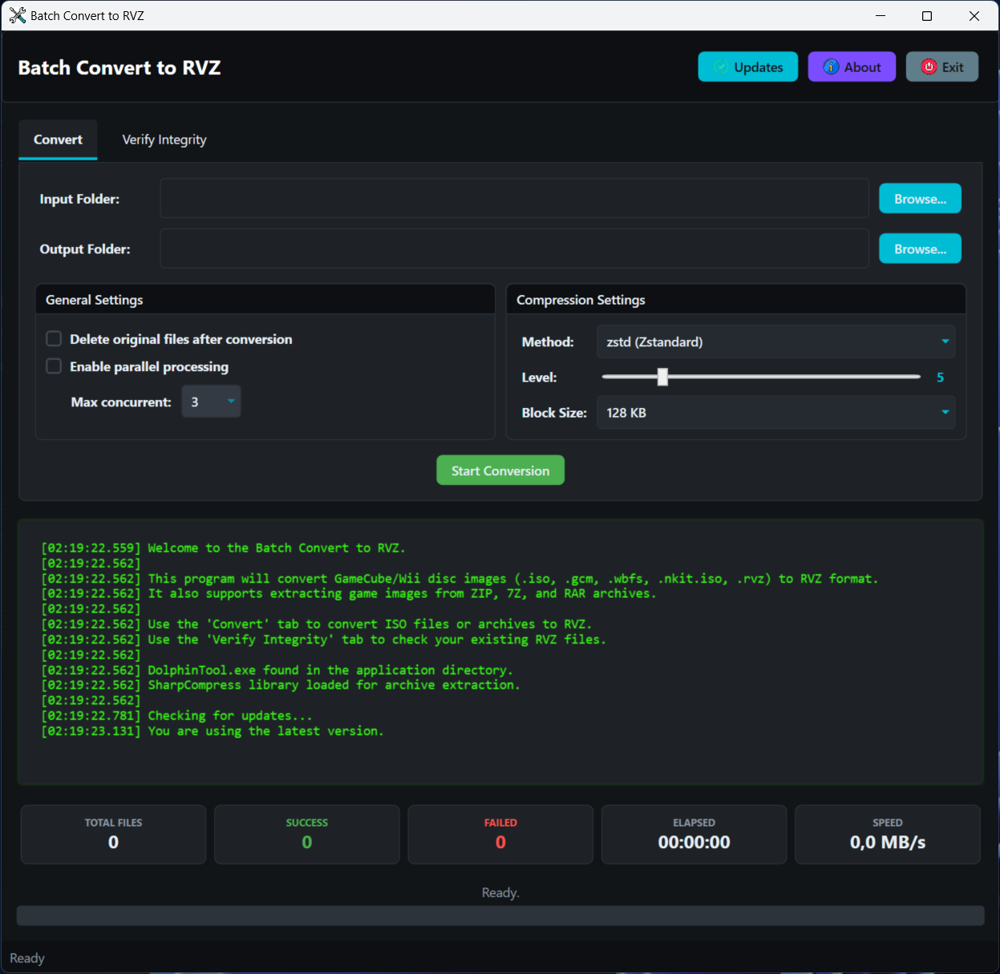

# Batch Convert to RVZ

A Windows desktop utility for batch converting GameCube and Wii ISO images to RVZ format with verification capabilities.

## Overview

Batch Convert to RVZ is a comprehensive Windows application that provides a simple user interface for converting multiple GameCube and Wii ISO files to the RVZ format.
It uses **DolphinTool.exe** from the Dolphin Emulator project for conversions and verification, while providing a user-friendly interface for batch processing.
The application also supports extracting ISO images from archives and allows parallel conversion for improved performance.

## Features

### Conversion Features
- **Batch Processing**: Convert multiple files in a single operation
- **Supported Formats**: Handles GameCube and Wii ISO files (`.iso`) and archives containing them
- **Archive Support**: Automatically extracts and processes ISO files from `.zip`, `.7z`, and `.rar` archives
- **7-Zip Integration**: Use the SevenZipSharp library with architecture-specific 7z DLLs for reliable archive extraction
- **Parallel Processing**: Optionally process multiple files in parallel (up to 3 concurrent files) to speed up batch completion
- **Smart File Handling**: Skips files that already exist in the output directory
- **Delete Original Option**: Option to remove source files (including archives) after successful conversion

### Verification Features
- **RVZ Integrity Verification**: Verify the integrity of existing RVZ files using DolphinTool
- **Batch Verification**: Check multiple RVZ files in a single operation
- **File Organization**: Optionally move verified/failed files to organized subfolders
- **Detailed Reporting**: Get comprehensive verification results for each file

### User Experience
- **Tabbed Interface**: Separate tabs for conversion and verification operations
- **Real-time Progress Tracking**: Detailed progress indication with file-by-file status
- **Write Speed Monitoring**: Real-time display of conversion writes speeds
- **Processing Statistics**: Live updates on total files, success/failure counts, and processing time
- **Comprehensive Logging**: Detailed real-time logging with timestamps for all operations
- **Cancellation Support**: Gracefully cancel operations at any time
- **Auto-Update Checking**: Automatic update notifications with GitHub integration

### Advanced Features
- **Global Error Reporting**: Automatic bug reporting to developers with comprehensive error details
- **Memory Management**: Proper resource disposal and memory leak prevention
- **Configurable Compression**: Uses optimized RVZ compression settings (Zstandard, level 5, 128KB blocks)
- **Temporary File Management**: Intelligent cleanup of temporary extraction directories
- **Cross-Architecture Support**: Supports both x64 and x86 systems with appropriate 7z libraries

## Supported File Formats

### Input Formats
- **ISO files**: GameCube and Wii disc images (`.iso`)
- **Archive files**: ZIP, 7Z, and RAR archives containing ISO files (`.zip`, `.7z`, `.rar`)

### Output Formats
- **RVZ files**: Compressed GameCube/Wii disc images (`.rvz`)

## Requirements

- **Operating System**: Windows 7 or later
- **Runtime**: [.NET 9.0 Runtime](https://dotnet.microsoft.com/download/dotnet/9.0)
- **Dependencies**: All required files are included:
    - `DolphinTool.exe` (for conversion and verification)
    - `7z_x64.dll` and `7z_x86.dll` (for archive extraction)

## Installation

1. Download the latest release from the [Releases page](https://github.com/drpetersonfernandes/BatchConvertToRVZ/releases)
2. Extract the ZIP file to a folder of your choice
3. Run `BatchConvertToRVZ.exe`

## Usage

### Converting Files
1. **Select Input Folder**: Click "Browse" next to "Input Folder" to select the folder containing ISO files or archives to convert
2. **Select Output Folder**: Click "Browse" next to "Output Folder" to choose where the RVZ files will be saved
3. **Configure Options**:
    - Check "Delete original files after conversion" to remove source files after successful conversion
    - Check "Enable parallel processing" to convert multiple files concurrently (recommended for faster processing)
4. **Start Conversion**: Click "Start Conversion" to begin the batch process
5. **Monitor Progress**: Watch the progress bars, statistics, and detailed log messages
6. **Cancel (if needed)**: Click "Cancel" to stop the operation gracefully

### Verifying RVZ Files
1. **Switch to Verify Tab**: Click the "Verify Integrity" tab
2. **Select Verify Folder**: Click "Browse" to select the folder containing RVZ files to verify
3. **Configure Organization** (optional):
    - Check "Move failed RVZ files to '_Failed' subfolder" to organize problematic files
    - Check "Move successful RVZ files to '_Success' subfolder" to organize verified files
4. **Start Verification**: Click "Start Verification" to begin checking file integrity
5. **Review Results**: Check the log and statistics for detailed verification results

## About RVZ Format

RVZ is a compressed disk image format developed specifically for the Dolphin Emulator. It is designed to store GameCube and Wii game data efficiently while retaining all necessary information for emulation.

### Key Benefits
- **Efficient Compression**: Significantly reduces file sizes compared to raw ISO images using advanced compression algorithms like Zstandard
- **Lossless**: Compression is completely lossless, meaning no game data is lost during conversion
- **Metadata Preservation**: Maintains all important disc metadata and structure
- **Data Integrity**: Includes built-in verification to ensure image integrity
- **Full Compatibility**: Directly supported by modern versions of Dolphin Emulator
- **Faster Loading**: Often loads faster than uncompressed ISOs due to reduced I/O overhead

## Troubleshooting

- **Missing Dependencies**: Ensure `DolphinTool.exe` and the appropriate 7z DLL files are present in the application directory
- **Permission Issues**: Make sure you have read permissions for input directories and write permissions for output directories
- **Archive Extraction Failures**: Verify that the 7z libraries are not corrupted or missing
- **Conversion Errors**: Check the detailed log output for specific error messages
- **Performance Issues**: Try disabling parallel processing if you experience system instability
- **Auto-Reporting**: The application automatically reports unexpected errors to developers for continuous improvement

## Acknowledgements

- **DolphinTool**: Uses `DolphinTool.exe` from the [Dolphin Emulator project](https://dolphin-emu.org/) for RVZ conversion and verification
- **SevenZipSharp**: Uses the SevenZipSharp library with 7-Zip DLLs for reliable archive extraction
- **Development**: Created and maintained by [Pure Logic Code](https://www.purelogiccode.com)

## Support the Project

### ⭐ Give us a Star!
If you find this application useful, please consider giving us a star on GitHub! It helps others discover the project and motivates us to continue improving it.

[⭐ Star this project on GitHub](https://github.com/drpetersonfernandes/BatchConvertToRVZ)

### 💖 Support Development
This application is developed and maintained for free. If you'd like to support continued development and new features, consider making a donation:

[💖 Donate to Pure Logic Code](https://www.purelogiccode.com/donate)

Your support helps us:
- Add new features and improvements
- Maintain compatibility with new versions of dependencies
- Provide ongoing bug fixes and support
- Create more useful tools for the community

---

Thank you for using **Batch Convert to RVZ**! For more information, support, and other useful tools, visit [purelogiccode.com](https://www.purelogiccode.com).