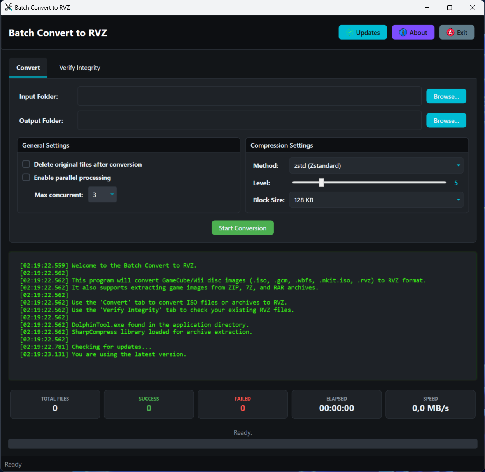
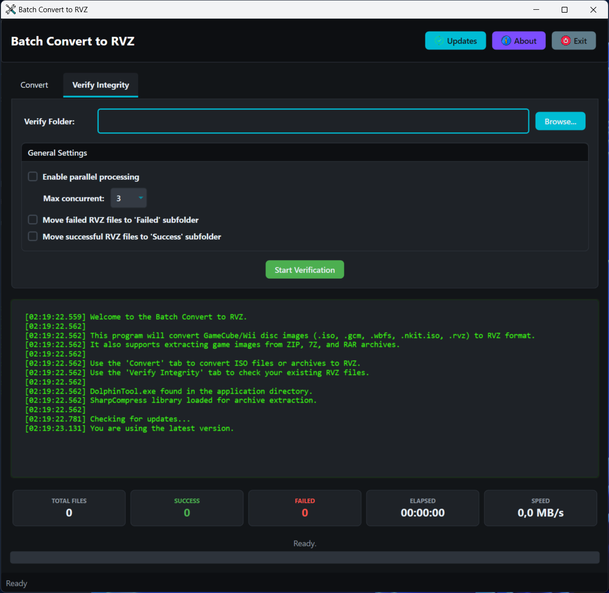

# Batch Convert to RVZ

[](https://github.com/drpetersonfernandes/BatchConvertToRVZ/releases)
[](https://dotnet.microsoft.com/download/dotnet/10.0)
[](LICENSE.txt)
[](https://github.com/drpetersonfernandes/BatchConvertToRVZ/releases)

A Windows desktop utility for batch converting GameCube and Wii disc images to RVZ format with verification capabilities.





## Overview

Batch Convert to RVZ is a comprehensive Windows application that provides a user-friendly interface for converting multiple GameCube and Wii game files to the RVZ format. It uses **DolphinTool** from the Dolphin Emulator project for conversions and verification, while providing advanced features like batch processing, archive extraction, and parallel processing for improved performance.

## Features

### Conversion Features
- **Batch Processing**: Convert multiple files in a single operation.
- **Supported Input Formats**: Handles GameCube and Wii disc images (`.iso`, `.gcm`, `.wbfs`, `.nkit.iso`) and archives containing them (`.zip`, `.7z`, `.rar`).
- **Archive Extraction**: Automatically extracts and processes game files from ZIP, 7Z, and RAR archives using SharpCompress.
- **Configurable Compression**: Customize compression method, level, and block size for optimal results.
- **Parallel Processing**: Process multiple files concurrently (up to 3 files) to speed up batch completion.
- **Smart File Handling**: Skips files that already exist in the output directory.
- **Delete Original Option**: Optionally remove source files (including archives) after successful conversion.
- **Robust Parsing**: Advanced logic for handling compound extensions like `.nkit.iso` and localized number formats.

### Verification Features
- **RVZ Integrity Verification**: Verify the integrity of existing RVZ files using DolphinTool.
- **Real-time Feedback**: Live logging of DolphinTool verification output (not just at the end).
- **Batch Verification**: Check multiple RVZ files in a single operation.
- **Parallel Verification**: Verify multiple RVZ files concurrently (up to 3 files).
- **File Organization**: Automatically move verified files to `_Success` or `_Failed` subfolders.
- **Detailed Reporting**: Get comprehensive verification results for each file.

### User Experience
- **Smooth Progress Tracking**: A single, overall progress bar that smoothly tracks the entire batch operation, including real-time percentages from active tasks.
- **Intelligent Auto-Scroll**: The log viewer only snaps to the bottom if you are already looking at the latest logs, allowing you to read previous errors without interruption.
- **Immediate Cancellation**: Stop extractions and conversions instantly, even for massive 8GB+ files, thanks to asynchronous I/O and cancellation token support.
- **Optimized Logging**: High-performance log processing that handles thousands of lines without UI stuttering or high memory usage.
- **Thread-Safe Dialogs**: Robust UI handling that prevents crashes when showing error messages or update prompts from background threads.
- **Auto-Update Checking**: Accurate version comparison (e.g., matching `1.8.1` tags to `1.8.1.0` assembly versions) with seamless GitHub integration.

### Technical Features
- **Asynchronous Architecture**: Fully async/await implementation to keep the UI responsive during intensive I/O and processing.
- **Cross-Architecture Support**: Native support for both x64 and ARM64 Windows systems.
- **Global Error Reporting**: Automatic bug reporting to developers with comprehensive error details.
- **Robust Cleanup**: Asynchronous retry logic for deleting locked temporary files and directories.
- **Memory Management**: Efficient string handling and proper resource disposal to prevent leaks.

## Architecture

The application follows a modular architecture with clear separation of concerns:

| Component | Responsibility |
|-----------|----------------|
| `MainWindow` | UI coordination, user interaction handling, operation orchestration |
| `UpdateService` | GitHub API integration for checking application updates |
| `BugReportService` | Automatic error reporting to development team |
| `GitHubRelease` | Data model for GitHub release information |
| `DolphinTool` | External tool for RVZ conversion and verification |
| `SharpCompress` | Third-party library for archive extraction |

## Supported File Formats

### Input Formats
- **ISO files**: GameCube and Wii disc images (`.iso`)
- **GCM files**: GameCube disc images (`.gcm`)
- **WBFS files**: Wii Backup File System images (`.wbfs`)
- **NKit ISO files**: NKit compressed ISO files (`.nkit.iso`)
- **Archive files**: ZIP, 7Z, and RAR archives containing game files (`.zip`, `.7z`, `.rar`)

### Output Formats
- **RVZ files**: Compressed GameCube/Wii disc images (`.rvz`)

## Requirements

- **Runtime**: [.NET 10.0 Runtime](https://dotnet.microsoft.com/download/dotnet/10.0)
- **Operating System**: Windows 7 or later (x64 or ARM64)
- **Dependencies**: All required files are included in the release:
  - `DolphinTool.exe` (x64 systems)
  - `DolphinTool_arm64.exe` (ARM64 systems)

## Installation

1. Download the latest release from the [Releases page](https://github.com/drpetersonfernandes/BatchConvertToRVZ/releases)
2. Extract the ZIP file to a folder of your choice
3. Run `BatchConvertToRVZ.exe`

## Usage

### Converting Files

1. **Select Input Folder**: Click "Browse" next to "Input Folder" to select the folder containing game files or archives to convert.
2. **Select Output Folder**: Click "Browse" next to "Output Folder" to choose where the RVZ files will be saved.
3. **Configure General Settings**:
   - Check "Delete original files after conversion" to remove source files after successful conversion.
   - Check "Enable parallel processing" to convert multiple files concurrently (recommended for faster processing).
   - Set "Max concurrent files" (2-3) based on your system's capabilities.
4. **Configure Compression Settings**:
   - **Method**: Choose compression algorithm (zstd, zlib, lzma, lzma2, bzip2, lz4).
   - **Level**: Adjust compression level (varies by method, e.g., 1-22 for zstd).
   - **Block Size**: Select block size (32KB to 2MB, 128KB recommended).
5. **Start Conversion**: Click "Start Conversion" to begin the batch process.
6. **Monitor Progress**: Watch the smooth overall progress bar, statistics, and real-time log messages.
7. **Cancel (if needed)**: Click "Cancel" to stop the operation gracefully and instantly.

### Verifying RVZ Files

1. **Switch to Verify Tab**: Click the "Verify Integrity" tab.
2. **Select Verify Folder**: Click "Browse" to select the folder containing RVZ files to verify.
3. **Configure Options**:
   - Check "Enable parallel processing" to verify multiple files concurrently (up to 3).
   - Check "Move failed RVZ files to '_Failed' subfolder" to organize problematic files.
   - Check "Move successful RVZ files to '_Success' subfolder" to organize verified files.
4. **Start Verification**: Click "Start Verification" to begin checking file integrity with real-time feedback.
5. **Review Results**: Check the log and statistics for detailed verification results.

### Menu Options

- **File > Exit**: Close the application.
- **Help > Check for Updates**: Manually check for new versions on GitHub.
- **Help > About**: View application information and credits.

## Compression Settings Guide

### Compression Methods
| Method | Speed | Compression | Use Case |
|--------|-------|-------------|----------|
| **zstd** (default) | Fast | Good | Best balance for most users |
| zlib | Medium | Good | Maximum compatibility |
| lzma/lzma2 | Slow | Excellent | Maximum compression |
| bzip2 | Slow | Good | Alternative option |
| lz4 | Very Fast | Moderate | Speed priority |

### Recommended Settings
- **Default**: zstd, level 5, 128KB block size
- **Maximum Compression**: lzma2, level 9, 2MB block size
- **Fastest Conversion**: lz4, level 1, 32KB block size

## About RVZ Format

RVZ is a compressed disk image format developed specifically for the Dolphin Emulator. It is designed to store GameCube and Wii game data efficiently while retaining all necessary information for emulation.

### Key Benefits
- **Efficient Compression**: Significantly reduces file sizes compared to raw ISO images using advanced compression algorithms like Zstandard.
- **Lossless**: Compression is completely lossless, meaning no game data is lost during conversion.
- **Metadata Preservation**: Maintains all important disc metadata and structure.
- **Data Integrity**: Includes built-in verification to ensure image integrity.
- **Full Compatibility**: Directly supported by modern versions of Dolphin Emulator.
- **Faster Loading**: Often loads faster than uncompressed ISOs due to reduced I/O overhead.

## Troubleshooting

- **Missing Dependencies**: Ensure `DolphinTool.exe` (or `DolphinTool_arm64.exe` for ARM64 systems) is present in the application directory.
- **Permission Issues**: Make sure you have read permissions for input directories and write permissions for output directories.
- **Archive Extraction Failures**: Verify that the archive files are not corrupted. The app now supports instant cancellation if extraction hangs.
- **Conversion Errors**: Check the detailed real-time log output for specific error messages.
- **Performance Issues**: Try reducing the number of concurrent files if you experience system instability.
- **Auto-Reporting**: The application automatically reports unexpected errors to developers for continuous improvement.

## Development

### Project Structure
```
BatchConvertToRVZ/
├── App.xaml.cs              # Application entry point, global exception handling
├── MainWindow.xaml          # Main UI definition
├── MainWindow.xaml.cs       # Main UI logic and operation orchestration
├── UpdateService.cs         # GitHub update checking service
├── BugReportService.cs      # Automatic error reporting service
├── models/
│   └── GitHubRelease.cs     # GitHub API response model
├── icon/                    # Application icons
├── images/                  # UI images (menu icons, logo)
└── DolphinTool*.exe         # External conversion/verification tool
```

### Building from Source
1. Install [.NET 10.0 SDK](https://dotnet.microsoft.com/download/dotnet/10.0)
2. Clone the repository
3. Run `dotnet build` or open in Visual Studio / JetBrains Rider

## Acknowledgements

- **DolphinTool**: Uses `DolphinTool` from the [Dolphin Emulator project](https://dolphin-emu.org/) for RVZ conversion and verification.
- **SharpCompress**: Uses the [SharpCompress](https://github.com/adamhathcock/sharpcompress) library for reliable archive extraction.
- **Development**: Created and maintained by [Pure Logic Code](https://www.purelogiccode.com)

## Support the Project

### ⭐ Give us a Star!
If you find this application useful, please consider giving us a star on GitHub! It helps others discover the project and motivates us to continue improving it.

[⭐ Star this project on GitHub](https://github.com/drpetersonfernandes/BatchConvertToRVZ)

### 💖 Support Development
This application is developed and maintained for free. If you'd like to support continued development and new features, consider making a donation:

[💖 Donate to Pure Logic Code](https://www.purelogiccode.com/donate)

Your support helps us:
- Add new features and improvements
- Maintain compatibility with new versions of dependencies
- Provide ongoing bug fixes and support
- Create more useful tools for the community

---

Thank you for using **Batch Convert to RVZ**! For more information, support, and other useful tools, visit [purelogiccode.com](https://www.purelogiccode.com)
