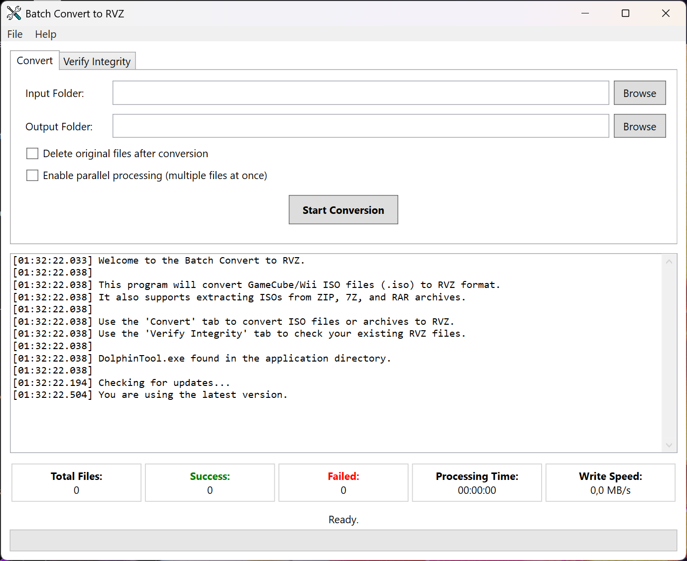

# Batch Convert to RVZ

A Windows desktop utility for batch converting GameCube and Wii ISO images to RVZ format.

## Overview

Batch Convert to RVZ is a Windows application that provides a simple user interface for converting multiple GameCube and Wii ISO files to the RVZ format.
It uses **DolphinTool.exe** from the Dolphin Emulator project for the actual conversions, while providing a user-friendly interface for batch processing.
**It also supports extracting ISO images from archives** and allows parallel conversion for improved performance.

## Features

- **Batch Processing**: Convert multiple files in a single operation.
- **Supported Formats**: Handles GameCube and Wii ISO files (`.iso`) **and archives containing them**.
- **Archive Support**: Automatically extracts and processes supported `.iso` files from `.zip`, `.7z`, and `.rar` archives.
- **7-Zip Integration**: Uses the SevenZipSharp library with `7z.dll` for `.7z` and `.rar` extraction, included with the application.
- **Parallel Processing**: Optionally process multiple files in parallel to speed up batch completion.
- **Progress Tracking**: Detailed progress indication and real-time logging during the conversion process.
- **Delete Original Option**: Option to remove source files (**including archives**) after successful conversion.
- **Global Error Reporting**: Automatic bug reporting to the developer with comprehensive error details.
- **User-Friendly Interface**: Simple and intuitive Windows interface.

## Supported File Formats

- **ISO files** (GameCube and Wii images, `.iso`)
- **ZIP, 7Z, RAR archives** (containing `.iso` files)

## Requirements

- Windows 7 or later
- [.NET 9.0 Runtime](https://dotnet.microsoft.com/download/dotnet/9.0)
- `DolphinTool.exe` (included with the application)
- `7z.dll` for archive extraction (included with the application)

## Installation

1. Download the latest release.
2. Extract the ZIP file to a folder of your choice.
3. Run `BatchConvertToRVZ.exe`.

## Usage

1. **Select Input Folder**: Click "Browse" next to "Input Folder" to select the folder containing `.iso` files **or archives** to convert.
2. **Select Output Folder**: Click "Browse" next to "Output Folder" to choose where the RVZ files will be saved.
3. **Delete Option**: Check "Delete original files after conversion" if you want to remove source files (**including archives**) after successful conversion.
4. **Parallel Processing Option**: Check "Enable parallel processing" to convert multiple files concurrently for faster batch completion.
5. **Start Conversion**: Click "Start Conversion" to begin the batch process.
6. **Monitor Progress**: The application displays progress bars and detailed log messages for each file during conversion.
7. **Cancel (if needed)**: Click "Cancel" to stop the ongoing conversion process gracefully.

## About RVZ Format

RVZ is a compressed disk image format developed specifically for the Dolphin Emulator. It is designed to store GameCube and Wii game data efficiently while retaining all necessary information for emulation.

- **Efficient Compression**: Significantly reduces file sizes compared to raw ISO images, often using advanced compression algorithms like Zstandard or Bzip2.
- **Lossless**: Compression is lossless, meaning no game data is lost during conversion.
- **Metadata Storage**: Preserves important disk metadata.
- **Data Integrity**: Includes checks to help ensure image integrity.

## Why Use RVZ?

- **Save Disk Space**: RVZ files are typically much smaller than the original ISO files, saving valuable storage space.
- **Full Compatibility**: Directly compatible with the Dolphin Emulator.
- **Preserve All Data**: Ensures a perfect copy of your game data is retained.
- **Faster Loading (sometimes)**: Depending on storage speed and CPU power, compressed formats like RVZ can sometimes load faster than uncompressed ISOs.

## Troubleshooting

- Ensure `DolphinTool.exe` and `7z.dll` are present in the same directory as the application.
- Make sure you have appropriate permissions to read from the input and write to the output directories.
- If `.7z` or `.rar` extraction is failing, verify that `7z.dll` is not missing.
- Review the application log window for detailed error messages during conversion.
- Automatic error reports will be sent to the developer if unexpected issues occur.

## Acknowledgements

- Use **DolphinTool.exe** from the [Dolphin Emulator project](https://dolphin-emu.org/) for RVZ file conversions.
- Uses the **SevenZipSharp** library with `7z.dll` for extracting `.7z` and `.rar` archives.
- Developed by [Pure Logic Code](https://www.purelogiccode.com).

---

Thank you for using **Batch Convert to RVZ**! For more information and support, visit [purelogiccode.com](https://www.purelogiccode.com).
